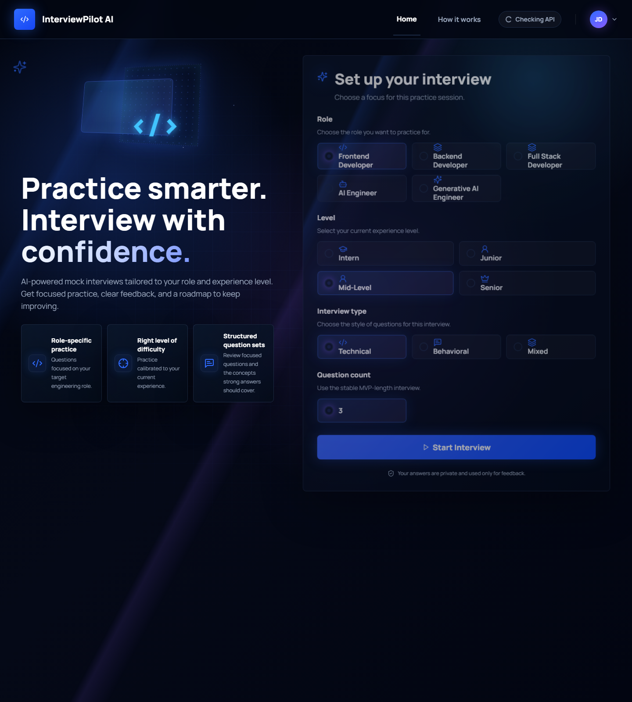
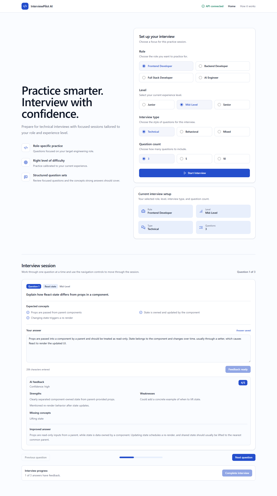
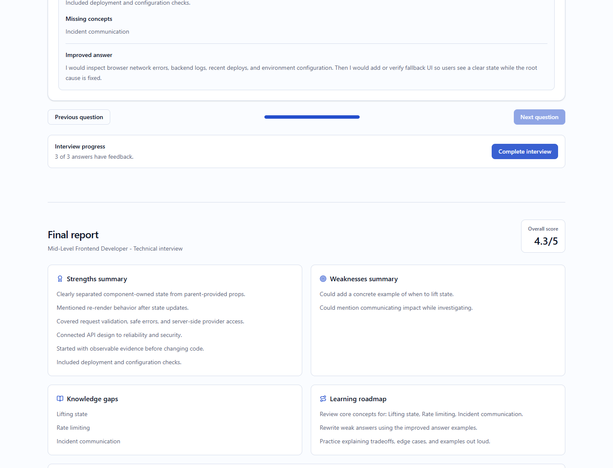
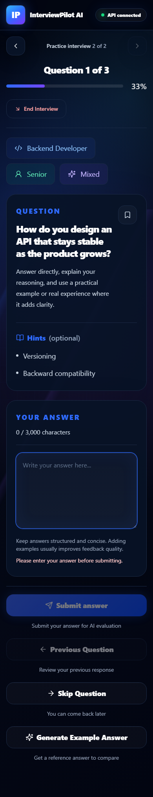
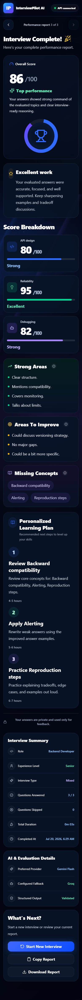
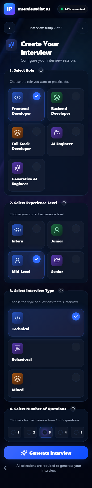

# InterviewPilot AI

InterviewPilot AI is a technical interview simulator. The current implementation
covers the Phase 1 flow through interview setup, AI question generation,
question-by-question navigation, AI answer evaluation, and a final report.
Deployment configuration is included for Vercel and Render. Authentication and
persistence are still pending.

## Live Demo

- Frontend: https://interviewpilot-ai-bice.vercel.app
- Backend health: https://interviewpilot-ai-server.onrender.com/api/health
- Repository: https://github.com/Avivmorad/InterviewPilot-AI

## Architecture At A Glance

```text
Browser
  -> React + Vite client
  -> Express API
  -> Gemini (primary)
  -> Groq (fallback)
```

## Project Structure

```text
interviewpilot-ai/
  client/   React + Vite + TypeScript
  server/    Node.js + Express + TypeScript
  docs/       Product and technical notes
  README.md
  .gitignore
```

## How It Works

1. The React frontend sends the selected role, level, interview type, and question count to
   `POST /api/interview/create`.
2. The Express route delegates to a thin controller and interview service.
3. The service validates the request and builds a focused generation prompt.
4. The AI service tries Gemini first and Groq as a fallback.
5. The service validates the generated JSON, assigns question IDs, and returns a
   predictable response to the frontend.
6. The frontend shows one question at a time and sends each submitted answer to
   `POST /api/interview/evaluate`.
7. The backend validates the AI feedback JSON before returning scores,
   strengths, weaknesses, gaps, and an improved answer.
8. The frontend stores evaluated answers in local state and builds a final
   report with an overall score, summaries, recommended topics, and a learning
   roadmap.

Provider SDKs and API keys remain in the backend. The frontend only knows the
JSON API contract.

Supported roles are Frontend Developer, Backend Developer, Full Stack
Developer, AI Engineer, and Generative AI Engineer. The stored API values are
`frontend-developer`, `backend-developer`, `full-stack-developer`,
`ai-engineer`, and `generative-ai-engineer`.

Supported experience levels are Intern, Junior, Mid-Level, and Senior. The
stored API values are `intern`, `junior`, `mid-level`, and `senior`.

AI Engineer remains the broader role for ML systems, data pipelines, model
training or inference, deployment, feature engineering, and MLOps. Generative AI
Engineer focuses on LLM application engineering, prompt design, structured
outputs, RAG, evaluations, provider fallback, safety, cost, latency, and
production reliability.

## Install Dependencies

From the project root:

```powershell
cd C:\Users\Daniel\Desktop\InterviewPilot-AI
npm install
```

## Start The Project

From the project root:

```powershell
.\runproject
```

This starts the client and server together.

## Run The Frontend

From the project root:

```powershell
npm run dev:client
```

Or from the client folder:

```powershell
cd C:\Users\Daniel\Desktop\InterviewPilot-AI\client
npm run dev
```

Open `http://localhost:5173`.

## Run The Backend

Open a second terminal:

From the project root:

```powershell
npm run dev:server
```

Or from the server folder:

```powershell
cd C:\Users\Daniel\Desktop\InterviewPilot-AI\server
npm run dev
```

The backend runs at `http://localhost:3001`.

To start both development servers from the project root:

```powershell
npm run dev
```

## Test The Health Endpoint

With the backend running:

```powershell
Invoke-RestMethod http://localhost:3001/api/health
```

Expected response:

```json
{
  "status": "ok",
  "message": "InterviewPilot AI backend is running"
}
```

## Create An Interview

Set at least one server API key in `server/.env`, using
`server/.env.example` as the template. Gemini is attempted first and Groq is
used as the fallback.

```powershell
$body = @{
  role = "generative-ai-engineer"
  level = "intern"
  interviewType = "Technical"
  questionCount = 3
} | ConvertTo-Json

Invoke-RestMethod `
  -Method Post `
  -Uri http://localhost:3001/api/interview/create `
  -ContentType "application/json" `
  -Body $body
```

The response contains a temporary `interviewId` and the generated questions.

## Evaluate An Answer

With the backend running:

```powershell
$body = @{
  question = @{
    id = "question-1"
    topic = "React"
    difficulty = "junior"
    question = "How does React state differ from props?"
    expectedConcepts = @("Props are passed in", "State is owned by a component")
  }
  answer = "Props come from parents. State is managed inside a component and can change."
} | ConvertTo-Json -Depth 5

Invoke-RestMethod `
  -Method Post `
  -Uri http://localhost:3001/api/interview/evaluate `
  -ContentType "application/json" `
  -Body $body
```

The response contains structured feedback used by the interview screen and final
report. Authentication and persistence are not included yet.

## Engineering Decisions

- Gemini is the primary provider and Groq is the fallback so the app can keep working when the primary provider is unavailable.
- The backend validates structured AI output before the client sees it, which keeps malformed responses from breaking the UI.
- The final report is generated in the frontend from already validated evaluations so the release stays deterministic and easy to reason about.
- The MVP stores the current interview session in memory instead of adding accounts or persistence too early.

## Evaluation Pipeline

- `npm run eval` runs the offline answer-evaluation dataset from the project root.
- The eval runner checks schema validity, score agreement, missing-concept coverage, and failure cases.
- `npm run eval:real` compares Gemini and Groq on the same dataset when both server-side API keys are configured.
- The real-provider runner records provider name, model name, latency, schema success, and score results, and can write a JSON report to disk.

## Known Limitations

- Authentication and persistence are not included in Phase 1.
- Production browser verification was completed in this audit; ongoing release management still depends on the Vercel and Render accounts.
- Real-provider evaluation is optional and still requires server-side Gemini and Groq keys.

The final Phase 1 production evidence is recorded in
[docs/verification/2026-07-20-production-verification.md](docs/verification/2026-07-20-production-verification.md).

## Screenshots

These deterministic UI screenshots were refreshed on July 20, 2026. The
interview API is mocked only while capturing screenshots so the images remain
stable; the production API is verified separately by the release smoke check.

### Interview Setup



### Answer Feedback



### Final Report



### Mobile Layouts

<p>
  
  
  
</p>

## Root Development Scripts

```powershell
npm run dev
npm run dev:client
npm run dev:server
npm run typecheck
npm run build
npm run check
npm run eval
npm run eval:real
npm run test:e2e
npm run screenshots:update
npm run scan:secrets
npm run smoke:production
```

- `npm run typecheck` checks frontend and backend TypeScript without building.
- `npm run build` creates production builds for frontend and backend.
- `npm run check` runs frontend linting, all typechecks, existing backend tests,
  and production builds.
- `npm run eval` runs the offline mocked evaluation dataset for answer-feedback
  prompt and schema behavior.
- `npm run eval:real` compares Gemini and Groq when both server-side API keys
  are configured and can write a JSON report to disk.
- `npm run test:e2e` verifies the main flow, responsive layouts, keyboard use,
  and automated accessibility rules.
- `npm run screenshots:update` refreshes deterministic desktop and mobile UI
  evidence with a mocked interview API.
- `npm run scan:secrets` scans tracked source for likely secrets.
- `npm run smoke:production` checks the deployed frontend, backend health, and
  production CORS behavior.

To run scripts from an individual workspace:

```powershell
cd C:\Users\Daniel\Desktop\InterviewPilot-AI\client
npm run typecheck
npm run lint
npm run build
npm run preview

cd C:\Users\Daniel\Desktop\InterviewPilot-AI\server
npm run typecheck
npm run build
npm run start
```

Run `npm run build` before `npm run start` in the backend because `start` runs
the compiled `server/dist/server.js` file.

## Deployment

Deployment config is included:

- `vercel.json` builds the `client` workspace for Vercel.
- `render.yaml` builds and starts the `server` service on Render.
- [docs/OPERATIONS_GUIDE.md](docs/OPERATIONS_GUIDE.md) lists the required
  production environment variables and verification checklist.

Production deploy still requires your Vercel and Render accounts, a GitHub repo,
and server AI provider keys configured as provider secrets. Never put Gemini or
Groq keys in client environment variables.

See [docs/OPERATIONS_GUIDE.md](docs/OPERATIONS_GUIDE.md) for browser and
PowerShell testing steps.
