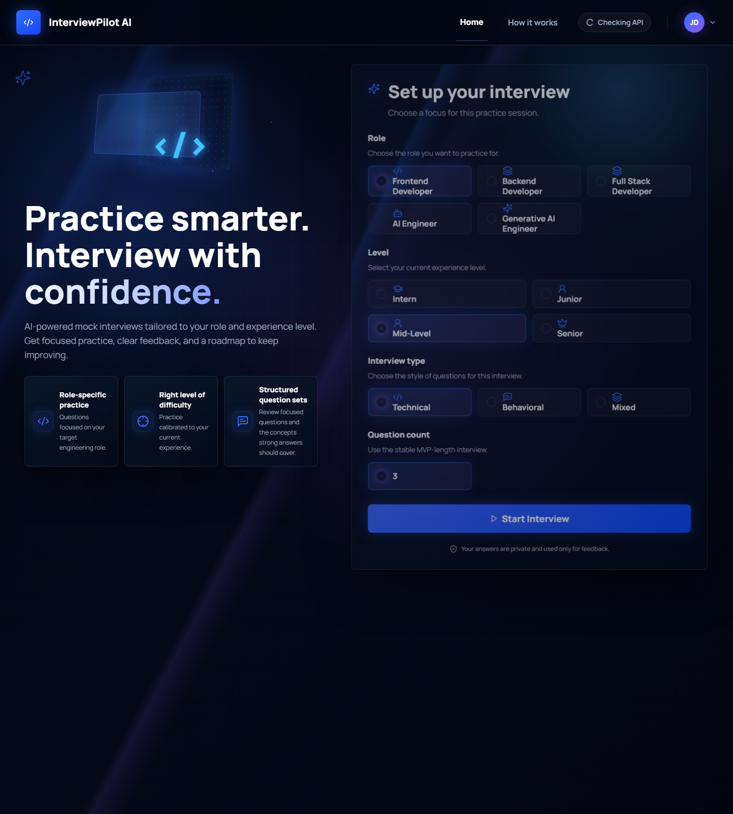
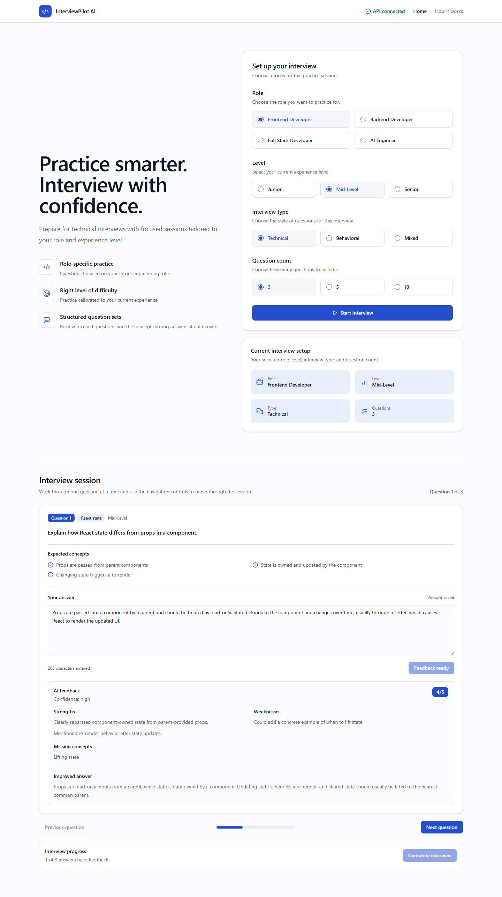
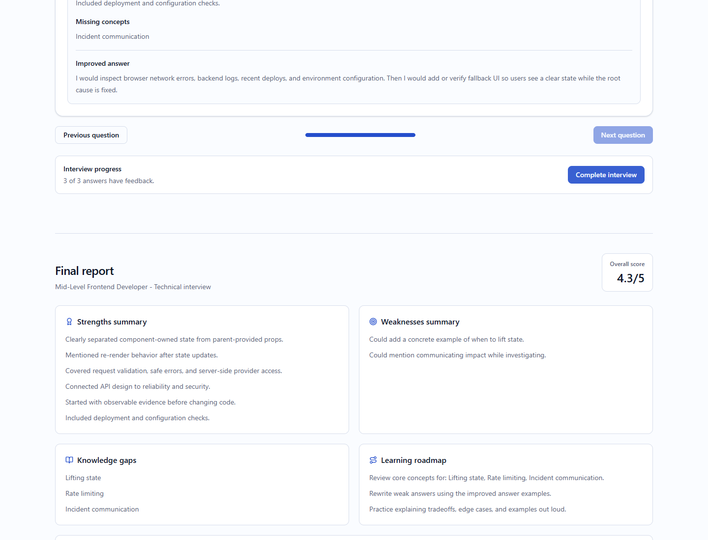

# InterviewPilot AI

[](https://github.com/Avivmorad/InterviewPilot-AI/actions/workflows/pr-ci.yml)

Deployed full-stack technical interview simulator that generates role-specific
questions, evaluates answers, and produces a structured final report. Gemini is
the primary provider, Groq is the fallback, and every AI response is validated
before it reaches the UI.

**[Open the live app](https://interviewpilot-ai-bice.vercel.app)** ·
**[Backend health](https://interviewpilot-ai-server.onrender.com/api/health)**

## Product flow

1. Choose a role, experience level, interview type, and question count.
2. Generate an interview through the Express API.
3. Answer or skip each question and request an example answer when needed.
4. Receive structured scores, strengths, weaknesses, missing concepts, and an
   improved answer.
5. Review a deterministic final report and learning roadmap.

## Screenshots

| Interview setup | Answer feedback | Final report |
| --- | --- | --- |
|  |  |  |

Mobile and additional UI evidence is available in
[`docs/screenshots/`](docs/screenshots/).

## Architecture

```text
React + Vite + TypeScript client
              |
              | validated JSON REST API
              v
Node.js + Express + TypeScript server
              |
              |-- Gemini (primary)
              `-- Groq (fallback / repair path)
```

- Provider SDKs and API keys remain server-side.
- Request payloads and model outputs are validated at system boundaries.
- Provider-specific responses are normalized behind one AI service interface.
- The final report is built from already validated evaluations, avoiding an
  extra uncontrolled LLM call.
- The active interview is intentionally held in client state; accounts and
  persistent history are outside the current product scope.

## Reliability and evaluation

- Zod-validated structured outputs with bounded repair and fallback behavior
- Offline evaluation dataset for schema validity, scoring, missing concepts,
  and failure cases
- Optional real-provider comparison for Gemini and Groq, including latency and
  schema results
- Client and server unit tests, Playwright E2E flows, Axe accessibility checks,
  secret scanning, production smoke checks, and pull-request CI
- Safe provider errors, request IDs, rate limits, CORS checks, and backend-only
  secrets

## API

| Method | Endpoint | Purpose |
| --- | --- | --- |
| `GET` | `/api/health` | Service health |
| `POST` | `/api/interview/create` | Generate validated interview questions |
| `POST` | `/api/interview/evaluate` | Evaluate one answer |
| `POST` | `/api/interview/example-answer` | Generate a model answer |

## Local setup

Requirements: Node.js 22+ and npm.

```sh
git clone https://github.com/Avivmorad/InterviewPilot-AI.git
cd InterviewPilot-AI
npm install
```

Create local environment files from `client/.env.example` and
`server/.env.example`. Configure at least one server-side provider key:

```dotenv
GEMINI_API_KEY=your_key
GROQ_API_KEY=your_optional_fallback_key
```

Start both workspaces:

```sh
npm run dev
```

Frontend: `http://localhost:5173` · Backend: `http://localhost:3001`

## Verification

```sh
npm run check
npm run eval
npm run test:e2e
npm run scan:secrets
```

Optional commands:

```sh
npm run eval:real
npm run smoke:production
npm run screenshots:update
```

`eval:real` requires both provider keys. The production smoke command uses the
deployed frontend and backend URLs documented in
[`docs/OPERATIONS_GUIDE.md`](docs/OPERATIONS_GUIDE.md).

## Deployment

- Vercel builds the `client` workspace through `vercel.json`.
- Render builds and starts the Express service through `render.yaml`.
- GitHub Actions runs separate client and server quality gates on pull requests.

The latest documented production sign-off is
[`docs/verification/2026-07-20-production-verification.md`](docs/verification/2026-07-20-production-verification.md).
Run a fresh production smoke check after release changes.

## License

Licensed under the [MIT License](LICENSE).
