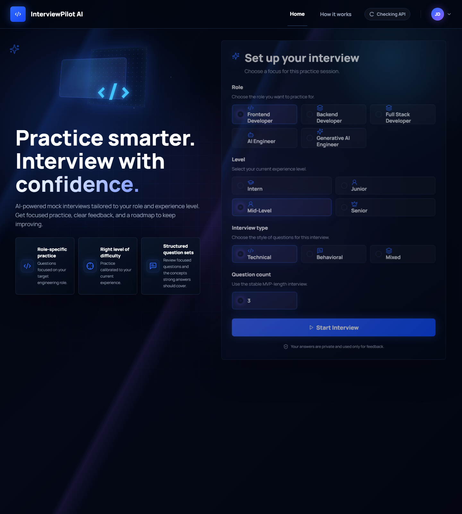
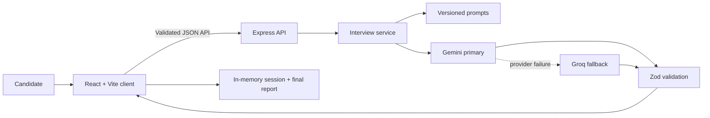
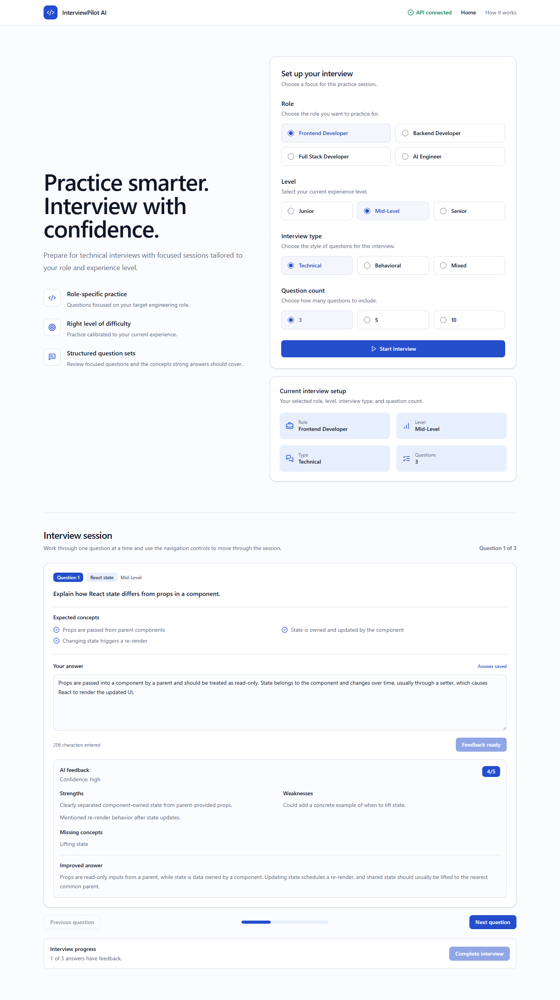
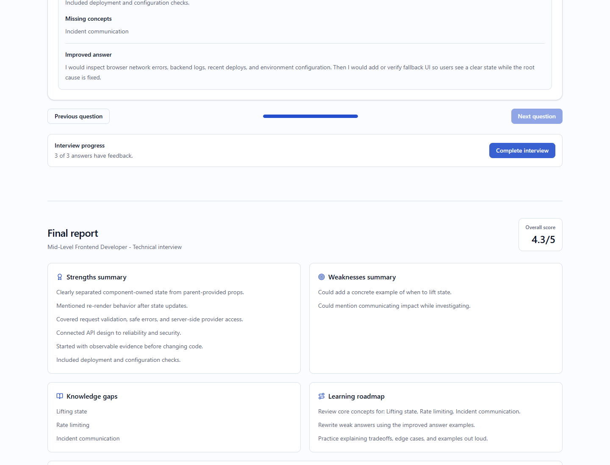
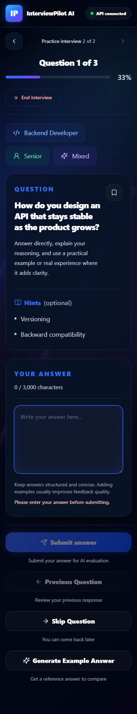
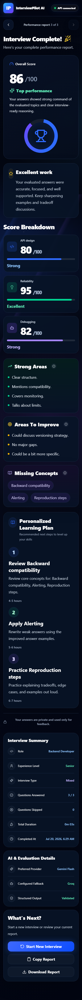
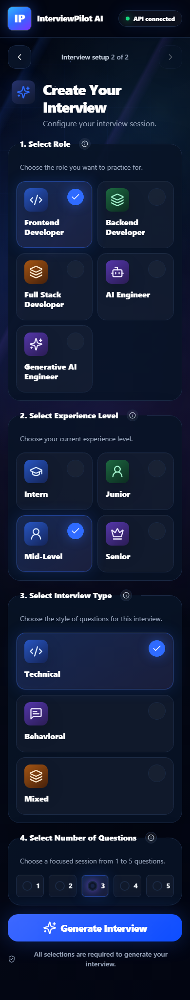

# InterviewPilot AI

> A full-stack technical interview simulator that turns a target role and experience level into an AI-generated practice session, structured feedback, and an actionable final report.

[](https://github.com/Avivmorad/InterviewPilot-AI/actions/workflows/pr-ci.yml)
[](https://interviewpilot-ai-bice.vercel.app)
[](https://interviewpilot-ai-server.onrender.com/api/health)
[](https://www.typescriptlang.org/)

**[Try the live app](https://interviewpilot-ai-bice.vercel.app)** · **[Check the API](https://interviewpilot-ai-server.onrender.com/api/health)** · **[Review the technical specification](docs/TECHNICAL_SPEC.md)**



## Why this project exists

InterviewPilot AI is a portfolio-focused demonstration of production-minded LLM application engineering. It goes beyond sending a prompt and displaying text: provider responses are constrained to explicit schemas, validated at runtime, retried within fixed limits, and passed through a Gemini-to-Groq fallback path before they reach the user interface.

The shipped MVP is designed for focused, repeatable practice. A candidate can configure an interview, answer one question at a time, review detailed feedback, request an example answer, and finish with a deterministic report assembled from the validated evaluations.

## Product highlights

- **Personalized sessions** — choose one of five engineering roles, four experience levels, three interview styles, and one to five questions.
- **AI-generated questions** — questions and expected concepts are tailored to the selected role, seniority, and interview type.
- **Structured answer evaluation** — every submitted answer receives a 0–100 score, strengths, weaknesses, missing concepts, an improvement suggestion, an improved answer, and a confidence level.
- **On-demand example answers** — generate a model answer and key points for the current question without submitting a candidate answer.
- **Final learning report** — review the overall score, strongest areas, priority gaps, recommended topics, and a learning roadmap.
- **Resilient provider integration** — Gemini is the primary provider and Groq is the fallback, with request timeouts, bounded retries, and provider-independent application contracts.
- **Responsive and accessible UI** — desktop and mobile layouts include keyboard flows and automated accessibility coverage.
- **Evaluation tooling** — offline fixtures guard prompt and schema behavior; an optional real-provider runner compares Gemini and Groq.

## Current product scope

The current release is a complete **session-based MVP**. Interview state is held in browser memory and is cleared when the page is refreshed. Account authentication, database-backed history, and cross-device persistence are not part of the mounted production experience.

Supabase scaffolding exists for future work, but it is intentionally not wired into the shipped flow.

### Supported configurations

| Category | Options |
| --- | --- |
| Roles | Frontend Developer, Backend Developer, Full Stack Developer, AI Engineer, Generative AI Engineer |
| Experience | Intern, Junior, Mid-Level, Senior |
| Interview type | Technical, Behavioral, Mixed |
| Question count | 1–5 questions |

## Architecture


```mermaid
flowchart LR
    U[Candidate] --> C[React + Vite client]
    C -->|Validated JSON API| A[Express API]
    A --> S[Interview service]
    S --> P[Versioned prompts]
    S --> G[Gemini primary]
    G -. provider failure .-> Q[Groq fallback]
    G --> V[Zod validation]
    Q --> V
    V --> C
    C --> R[In-memory session + final report]
```

### Request flow

1. The client submits the selected role, level, interview type, and question count to `POST /api/interview/create`.
2. A thin controller delegates validation and orchestration to the interview service.
3. The service builds a versioned prompt and asks the provider layer for structured output.
4. The AI service tries Gemini first, then Groq when the primary provider is unavailable or returns an unusable response.
5. Zod schemas validate external model output before the API returns it.
6. Answers sent to `POST /api/interview/evaluate` go through the same provider and validation boundary.
7. The React client keeps successful evaluations in memory and derives the final report locally.

Provider SDKs and secrets stay on the server. The browser only communicates with the application API.

## Technology stack

| Layer | Technologies |
| --- | --- |
| Frontend | React 19, Vite, TypeScript, Tailwind CSS, Radix UI primitives, Lucide icons |
| Backend | Node.js, Express 5, TypeScript, Zod |
| AI | Google Gemini Flash (primary), Groq (fallback), versioned prompts, structured JSON output |
| Quality | Node test runner, Playwright, axe-core, ESLint, TypeScript project checks |
| Delivery | GitHub Actions, Vercel (client), Render (API), Dependabot |

## Repository structure

```text
InterviewPilot-AI/
├── client/                    # React application, UI state, and API client
├── server/
│   └── src/
│       ├── ai/                # Provider adapters, prompts, and AI contracts
│       ├── controllers/       # HTTP request/response handlers
│       ├── evals/             # Offline and real-provider evaluation runners
│       ├── routes/            # Express route definitions
│       ├── services/          # Validation and interview orchestration
│       └── types/             # Shared backend domain types
├── tests/e2e/                 # Playwright user journeys and accessibility checks
├── scripts/                   # Screenshots, secret scan, and production smoke test
├── docs/                      # Product, technical, operations, and release notes
├── render.yaml                # Render API deployment
└── vercel.json                # Vercel client deployment
```

## Run locally

### Prerequisites

- Node.js 24 and npm (the same runtime used by CI)
- At least one server-side AI provider key:
  - [Google AI Studio](https://aistudio.google.com/) for Gemini, or
  - [GroqCloud](https://console.groq.com/) for Groq

Gemini is attempted first when both keys are present. Groq can also run by itself if no Gemini key is configured.

### 1. Clone and install

```bash
git clone https://github.com/Avivmorad/InterviewPilot-AI.git
cd InterviewPilot-AI
npm ci
```

### 2. Configure the environment

macOS/Linux:

```bash
cp client/.env.example client/.env
cp server/.env.example server/.env
```

PowerShell:

```powershell
Copy-Item client/.env.example client/.env
Copy-Item server/.env.example server/.env
```

Add at least one provider key to `server/.env`:

```dotenv
GEMINI_API_KEY=your_server_side_key
# Optional fallback when Gemini is configured; sufficient on its own otherwise:
GROQ_API_KEY=your_server_side_key
```

Do not add either provider key to `client/.env` or commit a populated `.env` file.

### 3. Start both applications

```bash
npm run dev
```

- Client: `http://localhost:5173`
- API: `http://localhost:3001`
- Health check: `http://localhost:3001/api/health`

The Windows helper `runproject.cmd` is also available from the project root. To run each workspace separately, use `npm run dev:client` and `npm run dev:server` in two terminals.

## Environment variables

### Client

| Variable | Required | Default | Purpose |
| --- | --- | --- | --- |
| `VITE_API_URL` | No | `http://localhost:3001` | Base URL for the Express API |

### Server

| Variable | Required | Default | Purpose |
| --- | --- | --- | --- |
| `PORT` | No | `3001` | HTTP port |
| `CLIENT_ORIGIN` | No | `http://localhost:5173` | Comma-separated CORS allowlist |
| `GEMINI_API_KEY` | One provider key | — | Gemini server credential |
| `GEMINI_MODEL` | No | `gemini-2.5-flash` | Gemini model identifier |
| `GROQ_API_KEY` | One provider key | — | Groq server credential or fallback |
| `GROQ_MODEL` | No | `openai/gpt-oss-20b` | Groq model identifier |

The Supabase variables in `server/.env.example` belong to unmounted scaffolding and are not required for the current MVP.

## API overview

| Method | Endpoint | Purpose | Success |
| --- | --- | --- | --- |
| `GET` | `/api/health` | Read API and deployment health | `200` |
| `POST` | `/api/interview/create` | Generate a validated interview | `201` |
| `POST` | `/api/interview/evaluate` | Evaluate one candidate answer | `200` |
| `POST` | `/api/interview/example-answer` | Generate an example answer and key points | `200` |

### Create an interview

```bash
curl -X POST http://localhost:3001/api/interview/create \
  -H 'Content-Type: application/json' \
  -d '{
    "role": "generative-ai-engineer",
    "level": "junior",
    "interviewType": "Technical",
    "questionCount": 3
  }'
```

The response contains a temporary `interviewId` and exactly the requested number of questions. That identifier is not persisted after the current browser session.

### Evaluate an answer

```bash
curl -X POST http://localhost:3001/api/interview/evaluate \
  -H 'Content-Type: application/json' \
  -d '{
    "question": {
      "id": "question-1",
      "topic": "Structured output",
      "difficulty": "junior",
      "question": "Why should an application validate an LLM JSON response?",
      "expectedConcepts": ["runtime validation", "safe failure handling"]
    },
    "answer": "Validation prevents malformed model output from entering the application and lets the service fail or retry safely."
  }'
```

All request bodies and AI-generated responses are validated before the application uses them. Expected failures return a JSON error with a stable `code` and a user-readable message.

## Quality and verification

```bash
npm run check              # lint, typecheck, unit tests, and production builds
npm run test:e2e           # core flow, responsive behavior, keyboard, and accessibility
npm run eval               # deterministic offline AI evaluation suite
npm run eval:real          # optional Gemini/Groq comparison; requires both keys
npm run scan:secrets       # scan tracked source for likely credentials
npm run screenshots:update # refresh deterministic product screenshots
```

Pull requests and pushes to `main` run separate client and server CI jobs. The server job also runs the offline evaluation dataset so prompt/schema regressions are treated as build failures.

The evaluation tooling measures schema validity, score agreement, missing-concept coverage, provider failures, and latency. Real-provider results can be written to JSON for later comparison; they are intentionally optional because they consume external API quota.

## Engineering decisions

- **Validate rather than trust model output.** Zod schemas protect the application boundary, while repair prompts and bounded retries handle recoverable formatting failures.
- **Keep providers interchangeable.** Application services depend on a shared AI interface rather than Gemini- or Groq-specific response objects.
- **Prefer graceful degradation.** A primary-provider failure can fall back to Groq, but the app never fabricates an evaluation if providers fail.
- **Keep the MVP honest and focused.** Browser-memory sessions avoid implying that auth or persistence is shipped before those workflows are complete.
- **Derive the report from validated data.** The final report does not require another model call, which makes completion faster and deterministic.
- **Version important prompts.** Generation, evaluation, and example-answer prompts are versioned in source, and the evaluation runner records the evaluation prompt version.

## Screenshots

| Answer feedback | Final report |
| --- | --- |
|  |  |

<p align="center">
  
  
  
</p>

Screenshots use a mocked interview API for deterministic content. The production integration is covered separately by the smoke-test script and the recorded verification notes.

## Deployment

- **Frontend:** Vercel builds the `client` workspace using `vercel.json`.
- **Backend:** Render builds and runs the `server` workspace using `render.yaml`.
- **Secrets:** Gemini and Groq keys must be configured only in the Render service environment.
- **CORS:** `CLIENT_ORIGIN` must include every deployed frontend origin that should call the API.

For deployment variables, operational checks, rollback notes, and production smoke-test commands, see the [operations guide](docs/OPERATIONS_GUIDE.md). The last recorded release verification is available in the [production verification report](docs/verification/2026-07-20-production-verification.md).

## Known limitations

- Sessions and final reports are not persisted after a browser refresh.
- There is no mounted sign-up, sign-in, or interview-history experience.
- Live interview generation and feedback depend on external provider availability, latency, and quota.
- The final report summarizes completed evaluations in the browser; it is not a separately generated AI assessment.
- `npm run eval:real` requires both Gemini and Groq credentials and may incur provider usage.

## Further documentation

- [Project overview](docs/PROJECT_OVERVIEW.md)
- [Technical specification](docs/TECHNICAL_SPEC.md)
- [Operations guide](docs/OPERATIONS_GUIDE.md)
- [Portfolio release notes](docs/release/PORTFOLIO_RELEASE.md)
- [Phase 2 roadmap](docs/roadmaps/PHASE2_ROADMAP.md)

---

Built as a production-oriented portfolio project for Generative AI Engineer, AI Engineer, and Software Engineer roles.
